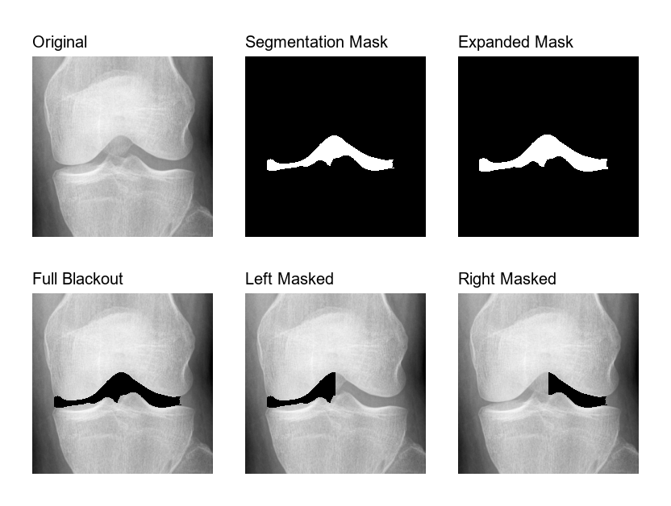

# Portfolio: Knee Osteoarthritis Segmentation Pipeline

This project demonstrates a complete computer vision pipeline for segmenting and processing knee X-ray images, specifically designed for osteoarthritis research.

## Pipeline Overview

The pipeline consists of four main stages, transforming raw knee X-rays into various processed versions for data augmentation and bilateral analysis.

### 1. Segmentation (U-Net)
Using a trained U-Net architecture, the model identifies the joint space region between the femur and tibia. This is the critical area for assessing osteoarthritis severity.
- **Model**: U-Net (PyTorch)
- **Performance**: 0.93 IOU on MOST dataset

### 2. Mask Expansion
To ensure complete coverage of the bone edges and provide more context for downstream models, the segmentation masks can be expanded using morphological dilation.
- **Technique**: Morphological Dilation
- **Customization**: Supports multiple expansion levels (S, M, L, XL)

### 3. Full Blackout
For testing model robustness and creating "negative" samples where joint space information is removed, the entire segmented region is replaced with black pixels.
- **Purpose**: Data augmentation and feature importance analysis

### 4. Bilateral Split Analysis
The pipeline can split the joint space mask vertically to create left-half and right-half masked versions.
- **Purpose**: Analyzing differences between medial and lateral compartments of the knee joint.

---

## Technical Stack
- **Language**: Python 3.10
- **Deep Learning**: PyTorch, Torchvision
- **Image Processing**: OpenCV, Scikit-Image, PIL
- **Data Handling**: Pandas, NumPy, PyDicom
- **Visualization**: Matplotlib

## Key Achievements
- Developed a streamlined pipeline for pre-cropped 224x224 knee images.
- Implemented automated mask expansion for improved data augmentation.
- Created batch processing scripts for large-scale medical dataset analysis.
- Achieved high segmentation accuracy (0.93 IOU) on external validation sets.
